<div align="center">
    <h1>Roblox dat.GUI</h1>
    
    <p align="center">
        dat.GUI - A lightweight graphical user interface and controller library that allows you to easily manipulate variables and fire functions on the fly, inspired by the venerable dat-gui js.
    </p>    
    <p>
        <a href="https://badge.fury.io/js/react-native-ui-blueprint">
            https://www.roblox.com/library/5802329341/dat-GUI
        </a>
    </p>
</div>

**TLDR;** 

```lua
local DatGUI = require(game.ReplicatedStorage:WaitForChild("dat.GUI"))

local obj = {
  Name = "Alex Rodin",
  Num = 1,
  Winner = true
}

local gui = DatGUI.new()

gui.add(obj, 'Name')
gui.add(obj, 'Num', 1, 50).step(1)
gui.add(obj, 'Winner')
```

## Links

- **Latest stable version**
    - https://www.roblox.com/library/5802329341/dat-GUI
- **Live Demo {SHOWCASE}**
    - https://www.roblox.com/games/5801132990/dat-GUI
- **Forum**
    - https://devforum.roblox.com/t/817209
- **Releases**
   - https://github.com/nidorx/roblox-dat-gui/releases
    
## Installation

You can do the installation directly from Roblox Studio, through the Toolbox search for `dat.GUI`, this is the minified version of the engine (https://www.roblox.com/library/5802329341/dat-GUI).

If you want to work with the original source code (for debugging or working on improvements), access the repository at https://github.com/nidorx/roblox-dat-gui


## Roblox dat.GUI

Allows you to easily manipulate variables and fire functions on the fly, inspired by the venerable dat-gui.

dat.GUI magically generates a graphical user interface (sliders, color selector, etc) for each of your variables.

dat.gui's niche is in listening to and controlling data such that it can be visualized into charts or other graphics. Creating a new DAT.GUI instance provides a new sliding pane for which to add controls to:

## Use cases

* To visually debug the various variables in your scripts during development
* To create a rich interface for your auxiliary tools (map editors, effects editors, etc.)
* For the construction of fast administrative interfaces


## How to use

In your script, import the dat.GUI and instantiate it

```lua
local DatGUI = require(game.ReplicatedStorage:WaitForChild("dat.GUI"))

-- Create an instance, which also creates a UI pane
local gui = DatGUI.new();
```

### Color3, Color3Value
---
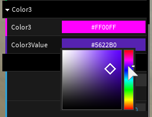

```lua
local color3Value = Instance.new('Color3Value')
local Color3Object = {
   Color3 = Color3.fromRGB(255, 0, 255),
   Color3Value = color3Value
}

gui.add(Color3Object, 'Color3').listen().onChange(function(value)
   assert(Color3Object.Color3.R == value.R)
   assert(Color3Object.Color3.G == value.G)
   assert(Color3Object.Color3.B == value.B)
end)

gui.add(Color3Object, 'Color3Value').listen().onChange(function(value)
   assert(Color3Object.Color3Value.Value.R == value.R)
   assert(Color3Object.Color3Value.Value.G == value.G)
   assert(Color3Object.Color3Value.Value.B == value.B)
end)
```

### Boolean, BoolValue
---
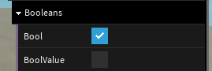

```lua
local boolValue = Instance.new('BoolValue')

local BooleansObject = {
   Bool = true,
   BoolValue = boolValue
}

gui.add(BooleansObject, 'Bool').listen().onChange(function(value)
   assert(BooleansObject.Bool == value)
end)

gui.add(BooleansObject, 'BoolValue').listen().onChange(function(value)
   assert(BooleansObject.BoolValue.Value == value)
end)
```

### Number, NumberValue
---
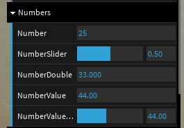

> Note: with a number slider available depending on options passed to it

```lua
local numberValue = Instance.new('NumberValue')
local NumbersObject = {
   Number = 25,
   NumberSlider = 0.5,
   NumberDouble = 33,
   NumberValue = numberValue,
   NumberValueSlider = numberValue
}

gui.add(NumbersObject, 'Number').step(1).listen().onChange(function(value)
   assert(NumbersObject.Number == value)
end)

gui.add(NumbersObject, 'NumberSlider', 0, 1).listen().onChange(function(value)
   assert(NumbersObject.NumberSlider == value)
end)

gui.add(NumbersObject, 'NumberDouble').step(0.001).listen().onChange(function(value)
   assert(NumbersObject.NumberDouble == value)
end)

gui.add(NumbersObject, 'NumberValue').listen().onChange(function(value)
   assert(NumbersObject.NumberValue.Value == value)
end)

gui.add(NumbersObject, 'NumberValueSlider', 0, 100).listen().onChange(function(value)
   assert(NumbersObject.NumberValueSlider.Value == value)
end)
```

### String, StringValue
---
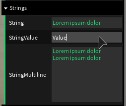

> Note: with Multiline option

```lua
local stringValue = Instance.new('StringValue')
local StringsObject = {
   String = 'Lorem ipsum dolor',
   StringValue = stringValue,
   StringMultiline = 'Lorem ipsum dolor \nLorem ipsum dolor '
}

gui.add(StringsObject, 'String').listen().onChange(function(value)
   assert(StringsObject.String == value)
end)

gui.add(StringsObject, 'StringValue').listen().onChange(function(value)
   assert(StringsObject.StringValue.Value == value)
end)

gui.add(StringsObject, 'StringMultiline', true).listen().onChange(function(value)
   assert(StringsObject.StringMultiline == value)
end)
```

### Options = Enum, EnumItem, Array (Strings), Object (Key => Value string)
---
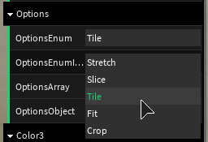

```lua
local OptionsObject = {
   OptionsEnum       = 2,
   OptionsEnumItem   = Enum.ScaleType.Slice,
   OptionsArray      = 1,
   OptionsObject     = 'THREE',
}

gui.add(OptionsObject, 'OptionsEnum', Enum.ScaleType).listen().onChange(function(value, text)
   assert(OptionsObject.OptionsEnum == value)
end)

gui.add(OptionsObject, 'OptionsEnumItem').listen().onChange(function(value, text)
   assert(OptionsObject.OptionsEnumItem == value)
end)

gui.add(OptionsObject, 'OptionsArray', {'One', 'Two', 'Three'}).listen().onChange(function(value, text)
   assert(OptionsObject.OptionsArray == value)
end)

gui.add(OptionsObject, 'OptionsObject', { ONE = 'One', TWO = 'Two', THREE = 'Three' }).listen().onChange(function(value, text)
   assert(OptionsObject.OptionsObject == value)
end)
```

### Vector3, Vector3Value
---
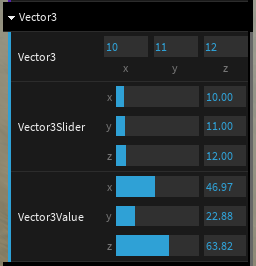

> Note: with a number slider available depending on options passed to it

```lua
local vector3Value = Instance.new('Vector3Value')
local Vector3Object = {
   Vector3 = Vector3.new(10, 11, 12),
   Vector3Slider = Vector3.new(10, 11, 12),
   Vector3Value = vector3Value
}

gui.add(Vector3Object, 'Vector3').step(1).listen().onChange(function(value)
   assert(Vector3Object.Vector3:FuzzyEq(value))
end)

gui.add(Vector3Object, 'Vector3Slider', 0, 100).listen().onChange(function(value)
   assert(Vector3Object.Vector3Slider:FuzzyEq(value))
end)

gui.add(Vector3Object, 'Vector3Value', 0, 100).listen().onChange(function(value)
   assert(Vector3Object.Vector3Value.Value:FuzzyEq(value))
end)
```

### Function, removeChild and changeName
---
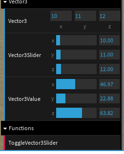

```lua
local toggleVec3Controller

local Vector3Object = {
   ToggleVector3Slider = function()
      if vec3Controller ~= nil then
         guiVector3.removeChild(vec3Controller)
         vec3Controller = nil
         toggleVec3Controller.name('AddVector3Slider')
      else
         vec3Controller = guiVector3.add(Vector3Object, 'Vector3Slider', 0, 100).listen().onChange(function(value)
            assert(Vector3Object.Vector3Slider:FuzzyEq(value))
         end)
         toggleVec3Controller.name('RemoveVector3Slider')
      end
   end
}

toggleVec3Controller = gui.add(Vector3Object, 'ToggleVector3Slider')
```

### More...
---

- `gui.addCustom(name, {Frame, Color, OnRemove, Height})`
   - 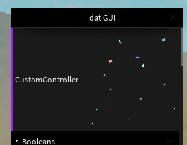
- `controller.help (text)`
   - 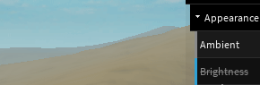
- `gui.addLogo(assetId, height)`
   - 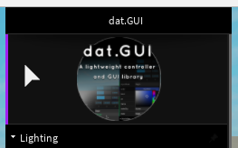
- pin folders
   - 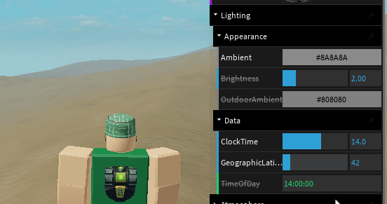
- move (stick when being moved)
   - 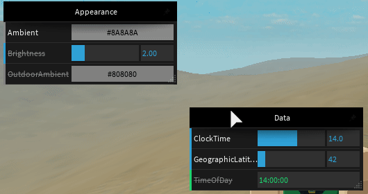
- resize
   - 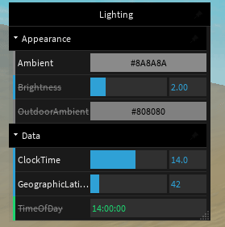
- close
   - 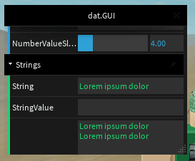
- actions
   - 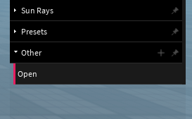


---

### API

#### Folder (GUI)

- *`DatGUI`*.**`new`***`(params)`*
- *`gui`*.**`addFolder`***`(name: string, params)`*
   - Creates a new GUI/subfolder instance
   - *`params`*.**`name`** The name of this GUI
      - *`{string}`*
   - *`params`*.**`parent`** The parent GUI
      - *`{gui}`* *`(optional)`*
   - *`params`*.**`width`** The initial width of the GUI
      - *`{number}`* *`(optional default=250)`*
   - *`params`*.**`closeable`** If true, this GUI can be permanently closed. (Only applicable if parent == nil) 
      - *`{bool}`* *`(optional default=false)`*
   - *`params`*.**`fixed`** If true, this folder cannot be unpinned from the parent. (Only applicable if parent ~= nil) 
      - *`{bool}`* *`(optional default=true)`*
   - *`params`*.**`closed`** If true, starts closed
      - *`{bool}`* *`(optional default=false)`*
- *`gui`*.**`add`***`(object, property: string, ...arguments)`* **`:Controller`**
   - Adds a new Controller to the GUI. The type of controller created is inferred from the initial value of `object[property]`.
- *`gui`*.**`addLogo`***`(assetId: string, height: number)`* **`:Controller`**
   - Add a control that displays an image.
- *`gui`*.**`addCustom`***`(name: string, config: number)`* **`:Controller`**
   - Allows creation of custom controllers
   - *`config`*.**`frame`** The content that will be presented in the controller
      - *`{Frame}`*
   - *`config`*.**`height`** the height of the content
      - *`{number}`*
   - *`config`*.**`color`** The color of the controller's side edge
      - *`{Color3}`* *`(optional)`*      
   - *`config`*.**`onRemove`** Invoked when controller is destroyed
      - *`{function()}`* *`(optional)`*     
   - *`config`*.**`methods`** Allows you to add custom methods that can be invoked by the controller instance
      - *`{{ [key:String] => function }}`* *`(optional)`*   
- *`gui`*.**`name`***`(name: string)`* 
   - Sets the name of the gui
- *`gui`*.**`open`***`()`* 
   - Opens the GUI
- *`gui`*.**`close`***`()`* 
   - Closes the GUI
- *`gui`*.**`remove`***`()`* 
   - Removes the GUI and unbinds all event listeners
- *`gui`*.**`removeChild`***`(child: GUI|Controller)`* 
   - Removes the given controller/folder from the GUI
- *`gui`*.**`resize`***`(width: number, height: number)`* 
   - Allows to resize the gui. Only applicable when `parent=nil` or is unpinned from parent
- *`gui`*.**`move`***`(hor, vert)`* 
   - Updates the position of the instance. Only applicable when `parent=nil` or is unpinned from parent
   - **`hor`** If negative, consider the position from the right edge of the screen
      - *`{number|"left"|"right"|"center"}`*
   - **`vert`** If negative, consider the position from the bottom edge of the screen
      - *`{number|"top"|"bottom"|"center"}`*
- *`gui`*.**`action`***`(config)`* 
   - Add an action button on the right side of the header
   - *`config`*.**`icon`** Roblox image asset url (Ex. `"rbxassetid://7229830060"`)
      - *`{string}`*
   - *`config`*.**`title`** Add a HINT on the icon
      - *`{string}`* *`(optional)`*
   - *`config`*.**`color`**
      - *`{Color3}`* *`(optional)`*
   - *`config`*.**`colorHover`**
      - *`{Color3}`* *`(optional)`*
   - *`config`*.**`onHover`**
      - *`{function(isHover: bool)}`* *`(optional)`*
   - *`config`*.**`onClick`**
      - *`{function()}`* *`(optional)`*
   - *`@return`*
      - *`{ {frame:Frame, remove:function()} }`*
- *`gui`*.**`onRemove`***`(callback: function) :RBXScriptConnection`* 
   - allows to be informed when the gui is removed
- **Gui Fields**
   - *`gui`*.**`Panel`** *`{Panel}`*
   - *`gui`*.**`Content`** *`{Frame =  panel.Content}`*

---

#### Controller

- *`controller`*.**`name`***`(name: string)`* **`:Controller`**
   - Sets the name/label of the controller
- *`controller`*.**`label`***`(visible: bool)`* **`:Controller`**
   - show/hide label
- *`controller`*.**`help`***`(text: string)`* **`:Controller`**
   - Add a help box when the cursor is positioned over the controller
- *`controller`*.**`readonly`***`(value: bool)`* **`:Controller`**
   - Disable editing of values by the controller
- *`controller`*.**`onChange`***`(callback: function)`* **`:Controller`**
   - Listening to Value Changes
- *`controller`*.**`getValue`***`()`* **`:value`**
   - Get the object's value
- *`controller`*.**`setValue`***`(value)`* **`:Controller`**
   - Sets the object's value
- *`controller`*.**`listen`***`()`* **`:Controller`**
   - Sets controller to listen for changes on its underlying object.
- *`controller`*.**`remove`***`()`*
   - Removes the controller from its parent GUI and unbinds all event listeners
- *`controller`*.**`onRemove`***`(callback: function) :RBXScriptConnection`* 
   - allows to be informed when the controller is removed
- **Controller Fields**
   - *`controller`*.**`frame`** *`{Frame}`*
   - *`controller`*.**`height`** *`{number}`*

---

#### Lib

Dat.GUI exposes the various components used internally. For usage details see source code

```lua
DatGUI.Lib = {
   Panel       = Panel, 
   Popover     = Popover,
   Scrollbar   = Scrollbar,
   GUIUtils    = GUIUtils,
   GuiEvents   = GuiEvents,
   Constants   = Constants
}
```

**DatGUI.Lib.Panel**

The basic structure of the GUI. Can be used to create custom dashboards outside of the DAT.GUI framework

- *`Panel`*.**`new`***`()`* **`:Panel`**
- *`panel`*.**`attachTo`***`(parent: Frame, isFixed: bool)`* 
   - Add this panel to another element. When doing this, the panel loses some features like scrollbar, resizing and moving
   - **`isFixed`** When true, no longer allow unpin this panel
- *`panel`*.**`detach`***`(closeable: bool)`* 
   - Unpin this panel from the parent element
   - **`closeable`** When true, display panel close button, if false, display panel atach button
- *`panel`*.**`resize`***`(width: number, height: number)`* 
   - Allows you to resize the panel only if it is detached
- *`panel`*.**`move`***`(hor, vert)`* 
   - Allows the panel to be moved (only when it is not fixed)
   - **`hor`** If negative, consider the position from the right edge of the screen
      - *`{number|"left"|"right"|"center"}`*
   - **`vert`** If negative, consider the position from the bottom edge of the screen
      - *`{number|"top"|"bottom"|"center"}`*
- *`panel`*.**`addAction`***`(config)`* 
   - Add an action button on the right side of the header
   - *`config`*.**`icon`** Roblox image asset url (Ex. `"rbxassetid://7229830060"`)
      - *`{string}`* 
   - *`config`*.**`title`** Add a HINT on the icon
      - *`{string}`* *`(optional)`*
   - *`config`*.**`color`**
      - *`{Color3}`* *`(optional)`*
   - *`config`*.**`colorHover`**
      - *`{Color3}`* *`(optional)`*
   - *`config`*.**`onHover`**
      - *`{function(isHover: bool)}`* *`(optional)`*
   - *`config`*.**`onClick`**
      - *`{function()}`* *`(optional)`*
   - *`@return`*
      - *`{ {frame:Frame, remove:function()} }`*
- *`panel`*.**`onDestroy`***`(callback: function) :RBXScriptConnection`* 
   - Add a callback to be executed when this panel is destroyed
- *`panel`*.**`destroy`***`()`* 
   - destroy this instance and unbinds all event listeners
- *`panel`*.**`updateContentSize`***`()`* 
   - Force update of content size information. Informs parents about the content update and triggers the scrollbar update
- **Panel Fields**
   - *`panel`*.**`Frame`** *`{Frame}`*
   - *`panel`*.**`Content`** *`{Frame}`*
   - *`panel`*.**`Header`** *`{Frame}`*
   - *`panel`*.**`Closed`** *`{BoolValue}`*
   - *`panel`*.**`Label`** *`{StringValue}`*

**DatGUI.Lib.Popover**

Popover is a tooltip-like component that allows displaying content above other screen elements. Internally used in ColorController and OptionController. There are 4 popover placement options ("left"|"top"|"bottom"|"right")

- *`Popover`*.**`new`***`(reference, size, position, offset)`*
   - Instantiate a new popover
   - **`reference`** GUI object used for popover positioning reference
      - *`{GUIObject|Frame}`*
   - **`size`** Popover dimensions
      - *`{Vector2}`*
   - **`position`** Preferred popover position.
      - *`{"left"|"top"|"bottom"|"right"}`* *`(optional default=top)`*
   - **`offset`** Allows you to add a margin between the reference object and the popover
      - *`{number}`* *`(optional default=0)`*
- *`popover`*.**`resize`***`(size: Vector2)`* 
- *`popover`*.**`show`***`(chevron: bool, chevronColor: Color3)`* 
- *`popover`*.**`hide`***`()`* 
- *`popover`*.**`destroy`***`()`* 
- **Popover Fields**
   - *`panel`*.**`Frame`** *`{Frame}`*

**DatGUI.Lib.GuiEvents**

Utility methods to facilitate interaction with interface events on elements

- *`GuiEvents`*.**`onEnter`***`(element :GUIObject|"*", callback :function(isEnter:bool)) :CancelFunction`*
   - Fired whenever the mouse is over the element (or when it starts a touch event)
- *`GuiEvents`*.**`onHover`***`(element :GUIObject|"*", callback :function(isHover:bool)) :CancelFunction`*
   - Fired when the mouse is over the element and this is the element with the highest Z-index
- *`GuiEvents`*.**`onDown`***`(element :GUIObject|"*", callback :function()) :CancelFunction`*
   - Fired when the mouse key is pressed over element and this is the element with the highest Z-index
- *`GuiEvents`*.**`onUp`***`(element :GUIObject|"*", callback :function()) :CancelFunction`*
   - Fired when the mouse is released over element and this is the element with the highest Z-index
- *`GuiEvents`*.**`onClick`***`(element :GUIObject|"*", callback :function()) :CancelFunction`*
   - The click event is sent to an element when the mouse pointer is over the element, and the mouse button 
   is pressed and released.
- *`GuiEvents`*.**`onMove`***`(element :GUIObject|"*", callback :function(position:Vector2)) :CancelFunction`*
   - Occurs when the mouse is moving over an element
- *`GuiEvents`*.**`onDrag`***`(element :GUIObject|"*", callback) :CancelFunction`*
   - Allows dragging elements
   - **`callback`** *`{function(event, startPos:Vector2, position:Vector2, delta:Vector2)}`*
      - *`event:"start"|"drag"|"end"`*
- *`GuiEvents`*.**`onScroll`***`(element :GUIObject|"*", callback :function(z:number)) :CancelFunction`*
   - Allows you to watch the mouse scroll over elements

**DatGUI.Lib.Scrollbar**
- [Scrollbar.lua](https://github.com/nidorx/roblox-dat-gui/blob/main/src/Shared/Lib/Scrollbar.lua)

**DatGUI.Lib.GUIUtils**
- [GUIUtils.lua](https://github.com/nidorx/roblox-dat-gui/blob/main/src/Shared/Lib/GUIUtils.lua)

**DatGUI.Lib.Constants**
- [Constants.lua](https://github.com/nidorx/roblox-dat-gui/blob/main/src/Shared/Lib/Constants.lua)

---

## Building your own dat.GUI

### To edit
1. Make sure Rojo 0.5.x or later is installed
2. Clone this repository to your computer
3. Set the location to this repo's root directory and run this command in CMD/PowerShell/Cmder:
    ```
    rojo serve
    ```
4. Create a new project on Roblox Studio and install Rojo Plugin, then, connect
5. Edit sources with Visual Studio Code, all changes will replicated automaticaly to Roblox Studio


### To build

In the terminal, enter the following:

```
npm install
npm run build
```

## Feedback, Requests and Roadmap

Please use [GitHub issues] for feedback, questions or comments.

If you have specific feature requests or would like to vote on what others are recommending, please go to the [GitHub issues] section as well. I would love to see what you are thinking.

## Contributing

You can contribute in many ways to this project.

### Translating and documenting

I'm not a native speaker of the English language, so you may have noticed a lot of grammar errors in this documentation.

You can FORK this project and suggest improvements to this document (https://github.com/nidorx/roblox-dat-gui/edit/master/README.md).

If you find it more convenient, report a issue with the details on [GitHub issues].

### Reporting Issues

If you have encountered a problem with this component please file a defect on [GitHub issues].

Describe as much detail as possible to get the problem reproduced and eventually corrected.

### Fixing defects and adding improvements

1. Fork it (<https://github.com/nidorx/roblox-dat-gui/fork>)
2. Commit your changes (`git commit -am 'Add some fooBar'`)
3. Push to your master branch (`git push`)
4. Create a new Pull Request

## License

This code is distributed under the terms and conditions of the [MIT license](LICENSE).

Developed on [JetBrains Intellij](https://www.jetbrains.com/community/opensource/#support)


[GitHub issues]: https://github.com/nidorx/roblox-dat-gui/issues
