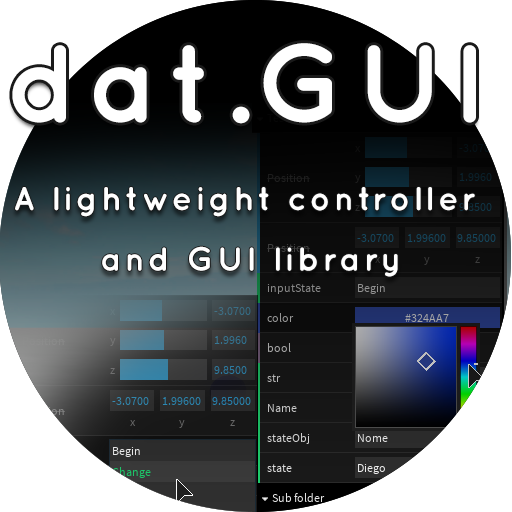

<div align="center">
    <h1>Roblox dat.GUI</h1>
    
    <p align="center">
        A lightweight graphical user interface and controller library
    </p>    
    <p>
        <a href="https://badge.fury.io/js/react-native-ui-blueprint">
            https://www.roblox.com/library/5802329341/dat-GUI
        </a>
    </p>
</div>

**TLDR;** 

```lua
local DatGUI = require(game.ReplicatedStorage:WaitForChild("dat.GUI"))

local obj = {
  Name = "Alex Rodin",
  Num = 1,
  Winner = true
}

local gui = DatGUI.new()

gui.add(obj, 'Name')
gui.add(obj, 'Num', 1, 50).step(1)
gui.add(obj, 'Winner')
```

## Links

- **Latest stable version**
    - https://www.roblox.com/library/5802329341/dat-GUI
- **Live Demo {SHOWCASE}**
    - https://www.roblox.com/games/5801132990/dat-GUI
- **Forum**
    - https://devforum.roblox.com/t/817209
- **Releases**
   - https://github.com/nidorx/roblox-dat-gui/releases
    
## Installation

You can do the installation directly from Roblox Studio, through the Toolbox search for `dat.GUI`, this is the minified version of the engine (https://www.roblox.com/library/5802329341/dat-GUI).

If you want to work with the original source code (for debugging or working on improvements), access the repository at https://github.com/nidorx/roblox-dat-gui


## Roblox dat.GUI

Allows you to easily manipulate variables and fire functions on the fly, inspired by the venerable dat-gui.

dat.GUI magically generates a graphical user interface (sliders, color selector, etc) for each of your variables.

dat.gui's niche is in listening to and controlling data such that it can be visualized into charts or other graphics. Creating a new DAT.GUI instance provides a new sliding pane for which to add controls to:

## Use cases

* To visually debug the various variables in your scripts during development
* To create a rich interface for your auxiliary tools (map editors, effects editors, etc.)
* For the construction of fast administrative interfaces


## How to use

1. In your script, import the dat.GUI and instantiate it

```lua
local DatGUI = require(game.ReplicatedStorage:WaitForChild("dat.GUI"))

-- Create an instance, which also creates a UI pane
local gui = DatGUI.new();
```

2. With the pane ready, new controls can be added.  Fields can be of type:

* String
* Number (with a number slider available depending on options passed to it)
* Boolean
* Function
* Options (Enum, Array, Object)
* Color3
* Vector3 (with a number slider available depending on options passed to it)

Here's how you can create a field of each type:

```lua
-- My sample object
local obj = {
  Name = "Alex Rodin",
  Num = 1,
  Winner = true
};

-- String field
gui.add(obj, 'Name')

-- Number field with slider
gui.add(obj, 'Num').min(1).max(50).step(1)
-- OR gui.add(obj, "num", 1, 50, 1)

-- Checkbox field
gui.add(obj, 'Winner')
```

## Building your own dat.GUI

### To edit
1. Make sure Rojo 0.5.x or later is installed
2. Clone this repository to your computer
3. Set the location to this repo's root directory and run this command in CMD/PowerShell/Cmder:
    ```
    rojo serve
    ```
4. Create a new project on Roblox Studio and install Rojo Plugin, then, connect
5. Edit sources with Visual Studio Code, all changes will replicated automaticaly to Roblox Studio


### To build

In the terminal, enter the following:

```
npm install
npm run build
```

##  @TODO
- [ ] Improve documentation (1 example of each type)
- [x] Ability to move the gui window around by dragging (or at least have some parameters to control where it’s placed)
- [x] Linethrough effect should be optional (maybe another method like readonly and disabled)
- [x] BUG (making the first option of the dropdown the current value)
- [x] BUG (Sometimes a controller does not unlock the UI)
- [x] Ability to set the color of text for folders (Themes)
- [x] Allow adding multiple GUI (tab system maybe)
- [ ] Add CFrame controller (number & slider)
- [x] Remove duplicate codes
- [x] Resize
- [x] Move
- [x] Custom Elements - Allow custom controllers (Controller Factory)
- [x] Hide label
- [x] On Remove
- [x] .help()
- [x] AddLogo
- [ ] AddTextInfo
- [ ] AddTextWarn
- [ ] AddImage
- [ ] AddLog
- [ ] AddChart
- [ ] AddCurve (curve controller)
- [x] Color e Enum tem de ser popup, pois o container agora vai fazer crop dos descendentes
- [x] Panel Order
- [x] Panel Close (Destroy)
- [x] Panel Zindex
- [ ] Save preferences
- [ ] Posicionamento por string (top, left, bottom, right)
- [ ] Theme creator (using DatGUI)


## Feedback, Requests and Roadmap

Please use [GitHub issues] for feedback, questions or comments.

If you have specific feature requests or would like to vote on what others are recommending, please go to the [GitHub issues] section as well. I would love to see what you are thinking.

## Contributing

You can contribute in many ways to this project.

### Translating and documenting

I'm not a native speaker of the English language, so you may have noticed a lot of grammar errors in this documentation.

You can FORK this project and suggest improvements to this document (https://github.com/nidorx/roblox-dat-gui/edit/master/README.md).

If you find it more convenient, report a issue with the details on [GitHub issues].

### Reporting Issues

If you have encountered a problem with this component please file a defect on [GitHub issues].

Describe as much detail as possible to get the problem reproduced and eventually corrected.

### Fixing defects and adding improvements

1. Fork it (<https://github.com/nidorx/roblox-dat-gui/fork>)
2. Commit your changes (`git commit -am 'Add some fooBar'`)
3. Push to your master branch (`git push`)
4. Create a new Pull Request

## License

This code is distributed under the terms and conditions of the [MIT license](LICENSE).

Developed on [JetBrains Intellij](https://www.jetbrains.com/community/opensource/#support)


[GitHub issues]: https://github.com/nidorx/roblox-dat-gui/issues
